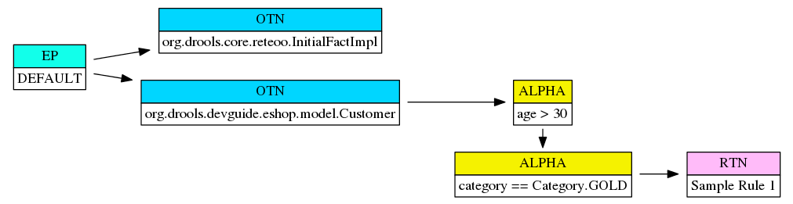
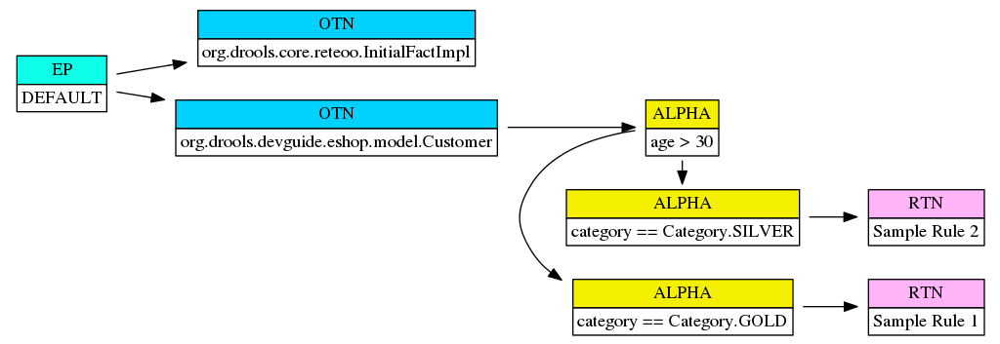
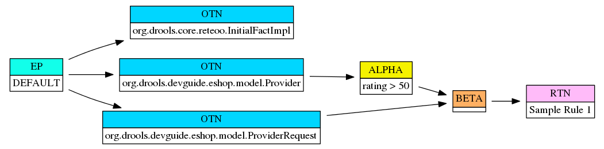
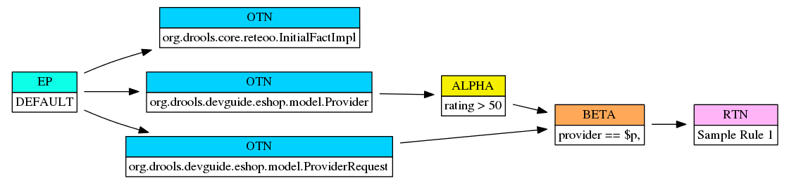

### Must watch inorder to understand the drools rule engine
* Official youtube intro (KIE youtube channel) : https://www.youtube.com/watch?v=IdS7dgSj3ds
* If you wanna test, uncomment and try running and analyze how this is working.

### Import function
1. If you want to import the function do as  "Import static function (denoted by either static or function keyword) of the class CustomerUserUtil"
  or, import static com.app.tracker.utils.CustomerUserUtil.compareDate; This is same as line below (i.e use either function or static)
   
2. To define function, use the function keyword as follows (Take this as an example): 
  ```groovy
   function boolean getFormattedDate() {
        LocalDateTime myDateObj = LocalDateTime.now();
        DateTimeFormatter myFormatObj = DateTimeFormatter.ofPattern("dd-MMM-yyyy");
        String formattedDate = myDateObj.format(myFormatObj);
        System.out.println("After Formatting Date, date is : " + formattedDate);
        return true;
}
```

   
### Global variable
1. To make variables global, use the global keyword followed by the full java package, followed by variable name
```groovy
global java.util.List myGlobalShoppingList; // make variable available globally
```


### Accumulate in drools : 
 - In drools, `accumulate` is a powerful construct that allows us to aggregate values over a set of matched facts.
 - General Syntax of `accumulate` is : 
 ```groovy
 $result : ResultType() from accumulate (
        FactType( conditions ),
        AggregateFunction( expression)
     )
 ```

eg, of accumulate (returns the list of customer users with userId greater than 400) : 
```groovy

      $userList : List() from accumulate (
         $customerUser : CustomerUser($customerUser.userId > 400),
         collectList( $customerUser )
      )
```

- ### Alpha Node:
    - Each individual constraint
      a pattern has is represented in the PHREAK network as an Alpha Node.
    - For eg: 
      ```groovy
           rule "Sample Rule 1"
           when
              $c: Customer(age > 30, category == Category.GOLD)
           then
           // ...
           end
      ```
      - The graph looks like following :  
  
    - ##### Alpha Node sharing : 
    ```groovy
        rule "Sample Rule 1"
       when
        $c: Customer(age > 30, category == Category.GOLD)
        then
            channels["gold-customer-channel"].send($c);
        end
  
        rule "Sample Rule 2"
        when
            $c: Customer(age > 30, category == Category.SILVER)
        then
            channels["silver-customer-channel"].send($c);
        end
    ```
  
     The graph looks like as : 
      
  
- ### Beta Nodes : 
  - When a rule is composed of more than one pattern, the Beta Node representing the join operation between each pair of
    patterns is created.
  -   ```groovy
          rule "Sample Rule 1"
          when
            $p: Provider(rating > 50)
            $pr: ProviderRequest()
          then
            channels["request-channel"].send($pr);
          end
      ```
      - 
  - One more example which shows the evaluation of the constraint when one variable from one fact is used in another,
    alpha-node will not be created for this and evaluation will happen at beta-node.
    eg: 
    ```groovy
        rule "Sample Rule 1"
        when
            $p: Provider(rating > 50)
            $pr: ProviderRequest(provider == $p)
        then
            channels["request-channel"].send($pr);
        end
    ```
    Example graph would be as follows : 
    
    Here, $p is used in checking, however, $p is defined in another fact. 
  - It would work the same even if we're doing as : 
    ```groovy
           $p: Provider($isRatingGreaterThan50 : rating > 50)
            $pr: ProviderRequest(this.providersRating == $isRatingGreaterThan50)
    ```
    ```this.providersRating == $isRatingGreaterThan50``` would have been evaluated in the beta-node as well.
  

